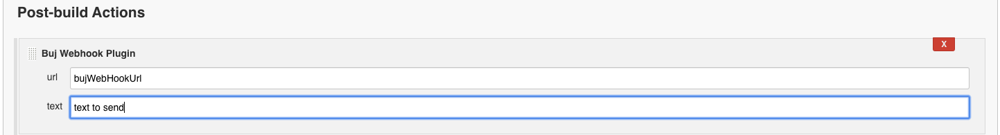

# Buj Jenkins WebHook Plugin

 
**Installation: **

- Build plugin using maven: mvn install
- Upload plugin to jenkins => Jenkins-Plugin Manager-Advanced-Upload Plugin


**Usage：**

- FreeStyle Job

  

- Pipeline Job

  ```groovy
  node {
     bujSend url:"bujWebHookUrl", text:"textToSend"
  }
  ```

